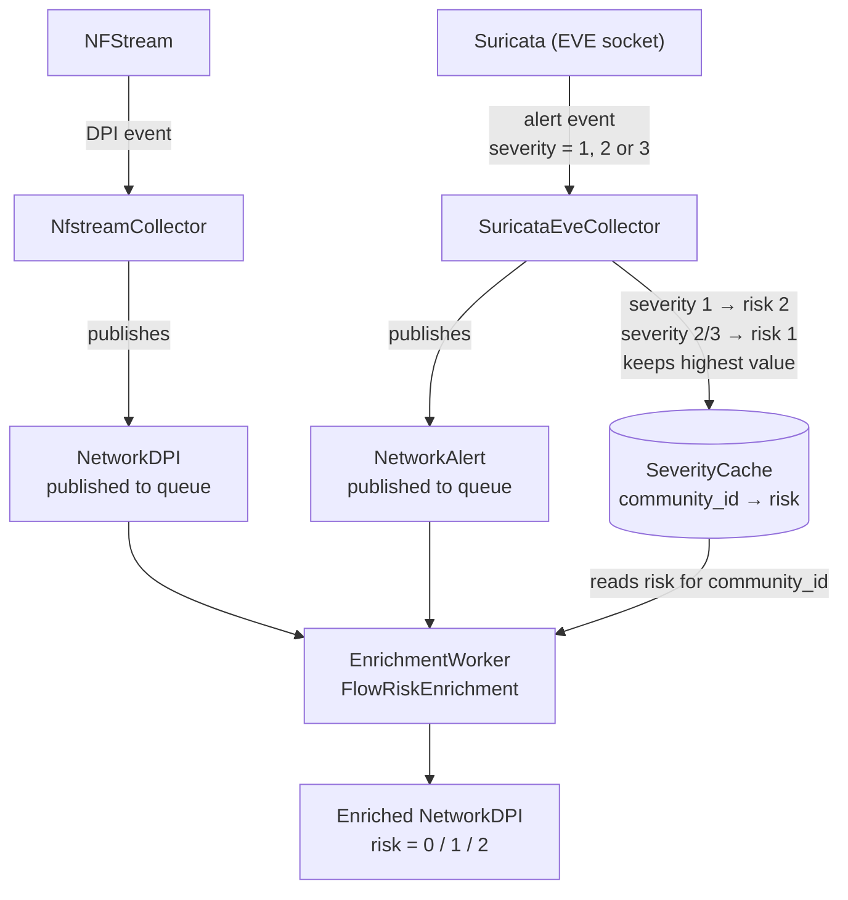

# Data correlation

Mongoose collects two complementary types of network events:

* [**Network DPI**](/docs/Mongoose/data-models#network-dpi) records describe *what* a device communicated and *how much* data was exchanged.
* [**Network Alert**](/docs/Mongoose/data-models#network-alert) records describe *whether a threat was detected* in that communication.

These two event types are produced independently, yet they always refer to the same underlying network conversation. Mongoose provides two mechanisms to bring related events together:

1. The **Community ID**: a standardized, deterministic identifier for a network flow. Any event that belongs to the same conversation carries the same Community ID, making it the primary correlation key.
2. The **risk score**: a single number on the Network DPI record that summarizes the highest threat level seen across all the alerts that matched the same flow. It turns the question *"was this connection dangerous?"* into a simple, filterable field.

## Correlating events with the Community ID

### What is the Community ID?

Every network conversation (a *flow*) is uniquely defined by five properties:

* Source IP address
* Source port
* Destination IP address
* Destination port
* Transport protocol (e.g. TCP, UDP)

The [Community ID specification](https://github.com/corelight/community-id-spec) defines a standard algorithm that hashes these five properties into a short string. Because the algorithm is deterministic and direction-agnostic, any tool that implements it produces *exactly the same value* for the same flow, regardless of which end of the conversation it observed first.

The result looks like this:

```txt
1:abc123def456==
```

The `1:` prefix is the version number, the rest is a Base64-encoded hash.

### How Mongoose assigns Community IDs

When a Network Alert arrives from Suricata it already carries a Community ID computed by Suricata. For Network DPI records produced by NFStream, the Community ID is computed by the `CommunityIDEnrichment` enricher using the same standard algorithm.

Because both tools follow the same specification, the `community_id` field is guaranteed to be identical for events that belong to the same flow.

:::info

The `community_id_b64` field contains the same value encoded in Base64. This variant is useful when passing the identifier in a URL or in a system that does not support the `=` padding character in plain text.

:::

### Linking a DPI record to its alerts

To find all the alerts raised for a given DPI record, filter the `network_alert` table where `community_id` equals the `community_id` of the DPI record.

Given a Network DPI record with:

```json
"community_id": "1:abc123=="
```

The related alerts can be retrieved with:

```sql
SELECT * FROM network_alert
WHERE community_id = '1:abc123==';
```

In the same way, starting from an alert you can retrieve the DPI record describing the full flow:

```sql
SELECT * FROM network_dpi
WHERE community_id = '1:abc123==';
```

Because the Community ID is indexed in the database, these lookups are fast even with large datasets.

### Cross-tool correlation

The Community ID is not specific to Mongoose. Many other security tools implement the same standard, including Suricata, Zeek, Wireshark and Elasticsearch. This means you can also correlate Mongoose events with records stored in external SIEMs or packet-capture files by matching on `community_id`.

## Understanding the risk score

### What is the risk score?

The `risk` field on a [Network DPI](/docs/Mongoose/data-models#network-dpi) record summarizes whether any Suricata alert was raised for the same flow, and how severe that alert was. It provides a quick, human-readable signal that answers the question *"should I look at this flow more closely?"*

| Value | Label | Meaning |
|-------|-------|---------|
| `0` | Normal | No alert was raised for this flow. The traffic appears benign based on the active detection rules. |
| `1` | Suspicious | At least one Suricata alert with a *low or medium* severity (Suricata severity `2` or `3`) was raised for this flow. Worth reviewing but not necessarily an immediate threat. |
| `2` | Critical | At least one Suricata alert with the *highest* severity (Suricata severity `1`) was raised for this flow. This indicates a high-confidence detection of malicious activity and should be investigated promptly. |

### How the risk score is computed

The risk score results from a two-step process spanning the collection and enrichment phases.

###### 1. Alert ingestion (collection phase)
When the `SuricataEveCollector` receives an alert from Suricata, it reads the alert's `severity` field and writes a risk value into an in-memory cache keyed by `community_id`:

* Suricata `severity = 1` (highest threat) gives risk `2` (critical).
* Suricata `severity = 2` or `3` (medium or low threat) gives risk `1` (suspicious).

The cache keeps the **highest** risk value ever seen for a given `community_id`. If a flow first triggers a low-severity alert and later a critical one, the cached value is upgraded to `2` and never downgraded.

###### 2. DPI enrichment (enrichment phase)
When the `FlowRiskEnrichment` enricher processes a Network DPI record, it looks up the record's `community_id` in the same cache and copies the stored value into the `risk` field of the DPI record. If no alert was ever registered for that `community_id`, the risk defaults to `0`.

The diagram below shows the full data flow:



The `SeverityCache` is a short-lived, in-memory structure. Its entries expire after a configurable TTL (time-to-live) to prevent stale data from accumulating. Entries for flows that are no longer active are automatically removed once they expire.

### Mapping between Suricata severity and Mongoose risk

| Suricata `severity` | Mongoose `risk` | Interpretation |
|---------------------|-----------------|----------------|
| `1` | `2` (Critical) | High-confidence threat (e.g. known malware, active exploitation). |
| `2` | `1` (Suspicious) | Medium-confidence indicator (e.g. potentially unwanted software, scanning activity). |
| `3` | `1` (Suspicious) | Low-confidence or informational alert (e.g. policy violation, unusual but not necessarily malicious behavior). |

:::info

Suricata severity values are set by the rule author and reflect how confident they are that the matched traffic is malicious. Severity `1` means the rule author considers the match a strong indicator of compromise. You can look up any rule by its `signature_id` on databases such as [Emerging Threats](https://rules.emergingthreats.net/) to read the full rule rationale.

:::

## Practical examples

### Example 1: no alert for a flow

A device browses a news website. No Suricata rule matches. The Network DPI record is stored with:

```json
"risk": 0,
"community_id": "1:aaabbbccc=="
```

No Network Alert record exists for this `community_id`.

### Example 2: suspicious activity

A device makes a connection that triggers a medium-severity Suricata rule (`severity = 2`). The collector writes `risk = 1` into the cache. The enrichment pipeline later sets the DPI record's `risk` field accordingly.

Network DPI record:

```json
{
  "community_id": "1:dddeeefff==",
  "risk": 1
}
```

Linked Network Alert record:

```json
{
  "community_id": "1:dddeeefff==",
  "severity": 2,
  "signature": "ET SCAN Potential SSH Scan",
  "category": "Attempted Information Leak"
}
```

### Example 3: critical threat

A device communicates with a known command-and-control server, triggering a Suricata rule with `severity = 1`. The collector writes `risk = 2`. Even if the same flow had previously triggered a lower-severity rule, the cache keeps the maximum value, so `risk` stays at `2`.

Network DPI record:

```json
{
  "community_id": "1:ggghhhiii==",
  "risk": 2
}
```

Linked Network Alert record:

```json
{
  "community_id": "1:ggghhhiii==",
  "severity": 1,
  "signature": "ET MALWARE CobaltStrike Beacon",
  "category": "A Network Trojan was Detected"
}
```

You can retrieve the full picture of the incident by joining both records on `community_id`: the DPI record tells you *how much* data was exchanged and *what application* was used, while the alert record tells you *which rule fired* and *what threat category* was identified.
