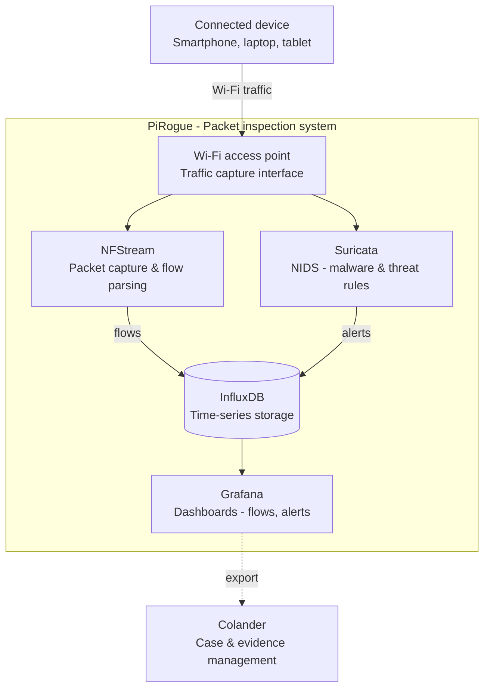

import CaptionedImage from '@site/src/components/CaptionedImage';

# Architecture

The PiRogue network router acts as a packet inspection system (PIS) that is used to detect potentially malicious network traffic of any device connected to its Wi-Fi access-point. It relies on the following components:

* **NFStream**: This component is responsible for capturing and parsing network traffic. It can capture traffic from a variety of sources, including physical interfaces, virtual interfaces, and network taps. NFStream also supports a variety of packet capture formats, including pcap, pcapng, and AF_PACKET.
* **Suricata**: This component is a network intrusion detection system (NIDS) that uses detection rules to identify malware and malicious traffic. Suricata supports a variety of detection rules, including rules from Snort and EmergingThreats. Suricata can also be used to generate alerts, which can be sent to a security information and event management (SIEM) system or other tools for further analysis.
* **InfluxDB**: This component is a time series database that is used to store and analyze the data collected by NFStream and Suricata. InfluxDB is a highly scalable database that can handle large volumes of data. It also supports a variety of query languages, including SQL, InfluxQL, and Flux.
* **Grafana**: This component is a data visualization tool that is used to display the data collected by NFStream and Suricata in a graphical format. Grafana supports a variety of dashboards and visualizations, which can be used to monitor the network traffic and alerts.

<CaptionedImage src="/img/pirogue/architecture.webp" alt="The architecture of the PiRogue" caption="The architecture of the PiRogue" align="center"/>

The PiRogue works as follows:

1. NFStream captures and parses network traffic and aggregates packets into flows.
2. NFStream sends the parsed traffic data to InfluxDB.
3. Suricata uses its detection rules to identify malware and malicious traffic.
4. Suricata sends alerts to InfluxDB when it detects known malicious traffic.
5. InfluxDB stores the alerts and network flows collected by Suricata and NFStream.
6. Grafana displays the data collected by NFStream and Suricata in a graphical format.

Analysts can use Grafana to monitor the PiRogue for malicious traffic detection. They can also use Grafana to browse and filter alerts and network flows.

Here is an example of how the PiRogue could be used to detect malware:

1. A user's device is infected with malware.
2. The malware sends network traffic to a command and control (C2) server.
3. NFStream captures the network traffic and aggregates it into flows, while Suricata inspects the same traffic.
4. Suricata matches the traffic against its detection rules and identifies the malware traffic.
5. Suricata sends an alert to InfluxDB, which stores it next to the flows.
6. Grafana displays the alert to the analyst.
7. The analyst investigates the alert and determines that the user's device is infected with malware.
8. The analyst takes steps to remediate the infection.

:::warning[Data retention]

The PiRogue keeps 5 days of history, data older than 5 days is automatically deleted.

:::